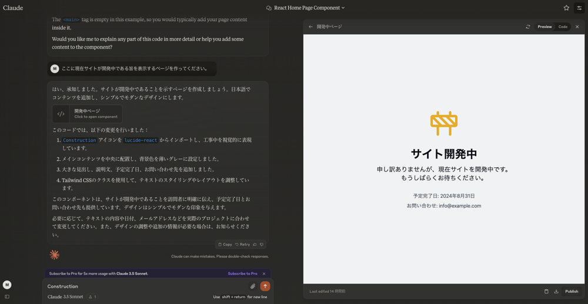

## 作り始めた動機

友人がブログを作成するように強く勧めてきたことをきっかけにブログ作りを始めた。

他にも、自分でサイトを継続して運営したことないなとか、フロントエンドの技術もしっかり触らないとなとか、アクセシビリティ勉強会に行って触発されたとか、色々な理由があったりする。

## 技術

Next.jsを使ってアプリケーションを作っていて、Cloudflare Pagesにデプロイしている。
特に強い理由はなく、友人がそうしていたので、自分もやってみたという感じだ。

初めてCloudflareを触ってみたけれど、GCPやAWSと違ってサイトが重くなくて感動した。Cloudflareありがとう、これからも使わせていただきます。

## 1日目にやったこと

Figmaでデザイントークンこねこねしようとしたら、まずは動くページを作れと友人に怒られた。
その通り過ぎるので、まずはnext.jsでプロジェクトを作って、GitHubリポジトリにあげて、デプロイすることから始めた。

1. nextjsのプロジェクトを作成。

`pnpm create cloudflare@latest space -- --framework=next`

コマンド一発でテンプレートを展開してくれて非常に助かる。本当に便利。

2. GitHubにリポジトリを作成してPush。

3. ドメインの購入

Cloudflareでmoytus.devを購入した。

4. CloudFlare Pagesにデプロイ

ボタンぽちぽちしてたらできた。簡単すぎる。

5. Claudeで工事中のページを作らせる

これで終了。明日はブログ機能を作る。
